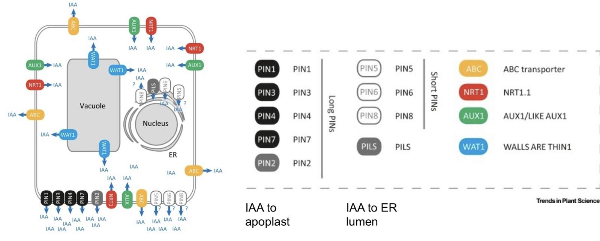
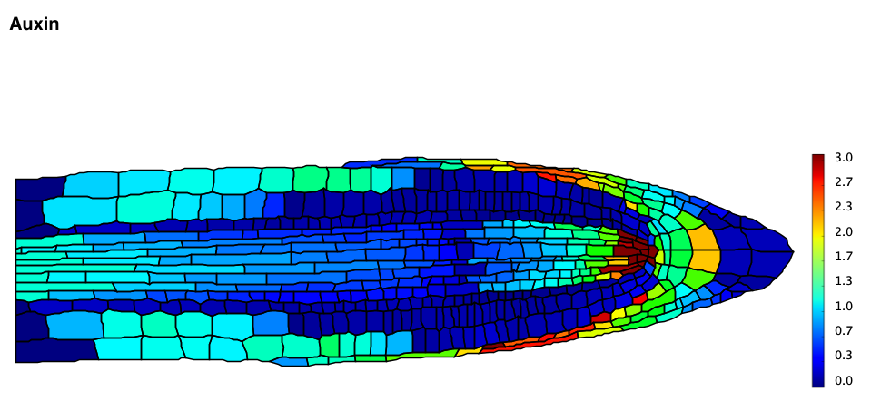
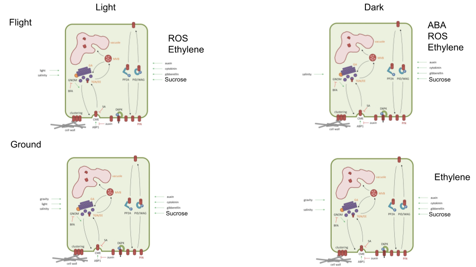
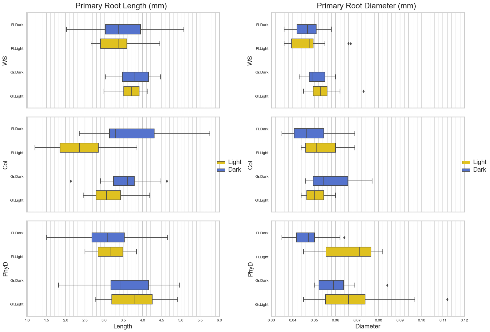
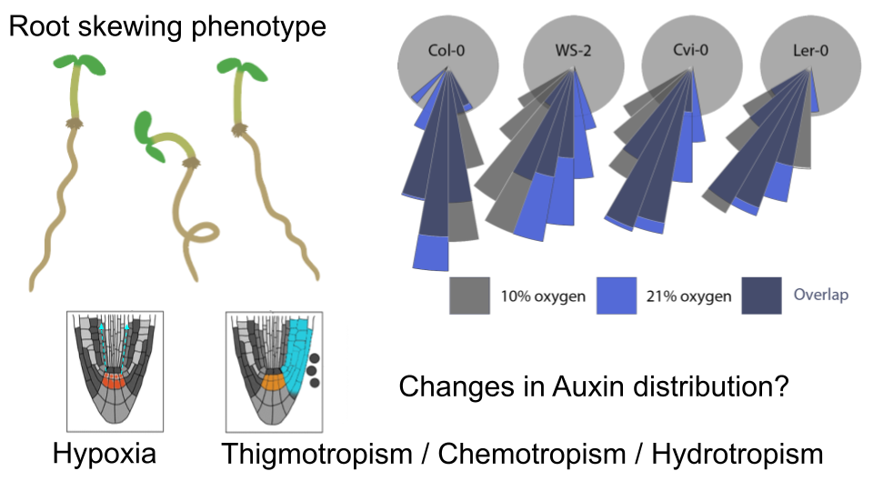
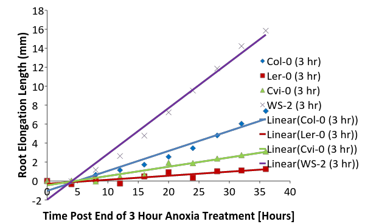

# CARA root modeling example reanalysis paper

**Title:** "Modulation of Photomorphogenesis in Spaceflight Alters Root System Architecture in WT Col causing dwarfing effect that is not observed but not in Col-0-_phyD_ and WS Mutants: New Insights from Deep Learning using images from ABRS and CARA mission".

**Abstract:**&#x20;

Photomorphogenesis and auxin transport are important processes that regulate root growth in plants. We investigated the role of these processes in root growth in microgravity by growing Arabidopsis thaliana seedlings in spaceflight or ground control conditions under light or dark conditions. Root growth was measured at various time points. RNA sequencing was used to identify genes that were differentially expressed in the spaceflight and ground control conditions. Mathematical modeling was used to simulate the effects of auxin transport on root growth. Our results showed that root growth was significantly reduced in spaceflight compared to ground control conditions for WT Col-0, but this reduction in root growth was more pronounced in seedlings that were grown under light conditions. RNA sequencing identified a number of genes that were differentially expressed in the spaceflight vs ground control conditions in both light and dark-grown samples. These genes included genes involved in auxin transport, sucrose/GA transport, photomorphogenesis, and cell signalling revealing that the addition of light enables more cellular and molecular adaptations to the effects of spaceflight. Mathematical modelling using PIN protein expression changes showed that the reduction in auxin accumulation in columella and lateral root caps of spaceflight samples explains the changes in root length and diameter. These results suggest that photomorphogenesis and auxin transport play important roles in root growth in microgravity. The reduction in auxin transport in spaceflight may be due to a number of factors, including changes in the cytoskeleton and cell wall structure. The results of this study have implications for the design of future plant-based life support systems for long-duration spaceflight.

**Keywords:** Arabidopsis, PIN transporters, auxin, spaceflight, root growth patterns, waving, skewing, circadian rhythm, Systems biology, mathematical modelling,

**Paper figure options**

[Link to slide show for clear version](https://docs.google.com/presentation/d/1Vr3eXuzvMWYQfodv9W8xeHwd7U6poq6ZMDsSzttPsys/edit?usp=sharing).



## Introduction

Plants are crucial for bioregenerative life-support systems in human space missions, necessitating resilience and adaptability to various gravity levels, including microgravity in space and partial gravity (partial-_g_) on the Moon or Mars. Gravity significantly influences plant growth and development through gravitropism. Studies have shown that plants undergo stress responses, including cellular changes and gene expression alterations, under microgravity and partial-_g_. Research conducted on the International Space Station (ISS) and on Earth has used seedlings and cell cultures to investigate these effects.

Results indicate that Mars gravity supports root gravitropic responses and maintains auxin transport, whereas Moon gravity triggers significant alterations, similar or more profound than those in microgravity. However, the impact under Mars gravity is less severe. An adaptive response involving WRKY transcription factors, which play a role in acclimation to these conditions, has been observed. These findings highlight the potential for plants to adapt to space conditions, suggesting the importance of including plant experiments in future Moon missions. Implementing a photoperiod regime has been effective in mitigating gravitational stress effects on root meristems, with light exposure bringing the experimental groups' measurements closer to control levels. Different responses were observed among nucleolin mutants, indicating differential sensitivity.

Root development is significantly influenced by light-regulated auxin signalling, involving key components like phytochromes, cryptochromes, phototropins, phytochrome-interacting factors, and COP1. These elements mediate various root growth aspects, including primary, lateral, and adventitious root formation, as well as root hair development and root branching, through the auxin signalling pathway. The mechanism underlying this regulation is complex, differing across species such as barley (_Hordeum vulgare_ L.) and wheat (_Triticum aestivum_ L.), and involves shifts in transcript levels and endogenous IAA content. This highlights the intricate relationship between light exposure and auxin in root development as a critical area for future horticultural research.

Plants depend on their roots for proper growth, with gravity critically shaping root structure. The process by which roots sense and respond to gravity involves two main models, both emphasizing the role of starch granules in initiating signal transduction upon gravity detection. Key signaling molecules such as indole-3-acetic acid (IAA), reactive oxygen species, and calcium ions play vital roles in this process, facilitating the downward growth of roots. Understanding these mechanisms, which involve complex interactions between starch, IAA, and calcium ions, not only advances our knowledge of plant root behavior in response to gravity but also sets the stage for further scientific exploration in plant biology.

This research aims to explore the impact of photomorphogenesis and auxin transport on root growth under microgravity conditions. Auxin, a pivotal plant hormone, plays a crucial role in various developmental stages, particularly in root expansion. Phytochromes, which detect light presence or absence, are integral in modulating downstream genes associated with auxin transport. Among the critical elements in photomorphogenesis, the phytochrome family serves as a key photoreceptor. Photomorphogenesis describes the adaptive growth and developmental responses of plants to light cues.

###

### Exploring Plant Tropisms and Microgravity

Plants have evolved to thrive under the influence of gravity, which plays a pivotal role in several of their growth and development processes. These include auxin transportation and various tropisms—namely, gravitropism, thigmotropism, chemotropism, oxytropism, and hydrotropism. When grown in microgravity conditions, however, the absence of gravity can significantly alter these processes, affecting overall plant growth and development. Research into the effects of microgravity on plant development has highlighted significant alterations in auxin signaling and transport pathways. These adaptations are seemingly pivotal for plants to manage the unique stresses of spaceflight, including regions of reduced oxygen supply. The findings suggest that plants might engage components of their gravitropic response systems to counteract the challenges posed by microgravity, pointing to a sophisticated level of stress response that utilizes established physiological mechanisms.

Research into the effects of microgravity on plant development has highlighted significant alterations in auxin signaling and transport pathways. These adaptations are seemingly pivotal for plants to manage the unique stresses of spaceflight, including regions of reduced oxygen supply. The findings suggest that plants might engage components of their gravitropic response systems to counteract the challenges posed by microgravity, pointing to a sophisticated level of stress response that utilizes established physiological mechanisms.

## Gravitropism and Auxin: Understanding Plant Growth

Gravitropism has intrigued scientists since the 19th century, notably beginning with Thomas Andrew Knight's observation that plant roots grow towards the center of the earth regardless of the seed's initial orientation. This phenomenon underscores a plant's innate ability to orient its growth in response to gravity, a crucial survival mechanism. The distribution of Auxin, a crucial hormone for plant growth, is influenced by gravity and light, which guides the direction of growth in plants. The amount of Auxin present is directly linked to the rate at which roots and stems grow, with variations in its concentration across different plant parts. The Cholodny-Went model, developed from the early 20th-century research by Nikolai Cholodny and Frits Warmolt Went, significantly advanced the understanding of gravitropism, demonstrating how plants respond to gravity, with the identification of Auxin playing a central role in plant growth orientation.

### Auxin's Journey and Gravitropism

Auxin (Indole-3-acetic acid, IAA) is transported to the root tip, where it is then redistributed to the root cortex and epidermis. This redistribution is key for the elongation zone of the root, where Auxin regulates cell growth. When a root is aligned perpendicularly to the gravity vector, statolith sedimentation in root cap cells enables the plant to detect the gravity direction. This leads to the asymmetrical distribution of Auxin on the root’s lower side, inhibiting elongation and causing the root to bend towards the gravity vector. Charles Darwin's earlier work had hinted at the sensitivity of plant tips to gravity, noting that influence from the tip prompts the rest of the plant to curve downward. However, it was Cholodny and Went who offered a detailed model based on methodical experimental observations. Gravitropism, driven fundamentally by Auxin dynamics, illustrates plants' exquisite adaptation to their environment, navigating growth directions with the earth's gravitational pull as a guiding force.

####

#### Auxin's Role in Gene Expression and Root Growth

Auxins, pivotal plant hormones, play a critical role in regulating gene expression by influencing the interactions between their receptors (TIR1-containing proteins) and Aux/IAA repressor proteins. This leads to the ubiquitination and degradation of repressor proteins, enabling the transcription of genes with Auxin Responsive Elements (ARE). At lower concentrations of Auxin, repressor proteins inhibit gene expression, affecting processes like root growth.

Upon experiencing a gravity stimulus, Auxin distribution shifts, promoting higher concentrations in the lower root part. This increase in Auxin concentration enhances the expression of ARE-containing genes, thus modulating cell growth and elongation rates. This mechanism of regulation of Auxin-mediated gene transcription and the gravitropic curvature of root tips, respectively. The DII-VENUS degradation data, quantifying Auxin's effects on gene expression, offers a dose- and time-dependent perspective on how exogenous Auxin concentrations influence the DII-VENUS signal.

Notably, a mathematical model elucidates the dynamics of Auxin redistribution post-gravity stimulus, aligning with the empirical data. This model showcases varying profiles of Auxin distribution and identifies the optimal correlation with experimental results, reflecting on the scientific endeavour to quantify and understand Auxin's regulatory functions in plant physiology.

Auxin swiftly redistributes within 5 minutes following a gravity stimulus, leading to root bending within approximately 10-20 minutes, aligning with its role in regulating root curvature. Notably, Auxin levels equalize around 100 minutes post-stimulus, coinciding with a root tip bending angle of circa 40°, suggesting a tipping point mechanism at this curvature degree. Subsequent phases involve the synthesis of Auxin response targets, indicating a complex regulatory framework for gravity-induced root bending. The employment of the DII-VENUS reporter alongside a mathematical model highlights the dynamic Auxin redistribution process, offering valuable kinetic insights. The model simplification to a single differential equation from initially four underscored the quasi-steady state assumption's effectiveness in capturing essential dynamics of Auxin-mediated responses.

In recent years, the application of systems biology and mathematical modelling to plant biology has led to the emergence of symstems biology. _Arabidopsis thaliana_ has emerged as a model system for these investigations due to its small genome and well-understood genetics.  SimuPlant Client is a program to visualise and interact with vertex-based models running on the SimuPlant Server. This download section is for SimuPlant: The Virtual Root, which features multi-cellular models of auxin transport within the _Arabidopsis_ root tip.

**Figure X1: (A)** Cellular model showing the subcellular location of Auxin transport and signaling components. **(B)** Root tip model illustrating auxin levels predicted by the reverse foundation model of auxin movement in the root and lateral apexes. Here’s a link to a [video of the model in action](https://www.youtube.com/watch?v=emd6tUy1pBo\&ab\_channel=RichardBarker).

**Supplementary Table X1:** Summary of PIN proteins, their subcellular location and the tissues where they’ve been shown to transport auxin. Image of immuno-fluorescent antibodies localisation can be found at NCBI Nottingham [https://www.ncbi.nlm.nih.gov/pmc/articles/PMC7738516/](https://www.ncbi.nlm.nih.gov/pmc/articles/PMC7738516/)

<table data-header-hidden><thead><tr><th width="151"></th><th></th><th></th><th></th><th></th></tr></thead><tbody><tr><td><strong>PIN protein</strong></td><td><strong>TAIR ID</strong></td><td><strong>Tissue</strong></td><td><strong>Subcellular location</strong></td><td><strong>Ref(s)</strong></td></tr><tr><td>PIN1</td><td>AT1G73590</td><td>Stelle, Vasculature, QC</td><td>Plasma membrane</td><td>Check &#x26; add ref</td></tr><tr><td>PIN2</td><td>AT1G29760</td><td>Epidermis, cortex,</td><td>Plasma membrane</td><td>Check &#x26; add ref</td></tr><tr><td>PIN3</td><td>AT1G29770</td><td>Columella</td><td>Plasma membrane</td><td>Check &#x26; add ref</td></tr><tr><td>PIN4</td><td>AT1G73580</td><td>QC, Initial cells</td><td>Plasma membrane</td><td>Check &#x26; add ref</td></tr><tr><td>PIN5</td><td>AT1G58860</td><td>x?x</td><td>Endoplasmic reticulum membrane</td><td>Check &#x26; add ref</td></tr><tr><td>PIN6</td><td>AT1G29780</td><td>x?x</td><td>Endoplasmic reticulum membrane</td><td>Check &#x26; add ref</td></tr><tr><td>PIN7</td><td>AT1G29790</td><td>Columella</td><td>Plasma membrane</td><td>Check &#x26; add ref</td></tr></tbody></table>

**Figure X2:** Illustration showing factors that are influence transcriptional regulation during plant adaption to space flight in the presence or absence of a light vector.&#x20;

### **Write & interacte Description of graphs below…**

### **Methods:**

In this study, we investigate the role of the PIN auxin transporter during spaceflight and translate environmental signals, such as light or dark, into changes in growth patterns. Additionally, we use mathematical modelling to study the effects of this transporter on Arabidopsis growth patterns during the CARA mission. Arabidopsis thaliana seedlings were grown in spaceflight or ground control conditions under light or dark conditions. Root growth was measured at various time points. RNA sequencing was used to identify genes that were differentially expressed in the spaceflight and ground control conditions. Mathematical modelling was used to simulate the effects of auxin transport on root growth.&#x20;

####

#### RNAseq Reanalysis by OSDR

The CARA (GLDS-120) experiments encompassed RNAseq analysis, utilizing the GeneLab data visualization system. RNASeq data from CARA processed by NASA **GeneLab provide many interactive data visualization options** [https://visualization.genelab.nasa.gov/data/GLDS-120](https://visualization.genelab.nasa.gov/data/GLDS-120)

####

#### Mathematical Modeling of Auxin Transport

This study focused on the significant role of PIN transporters in the distribution patterns of auxin within Arabidopsis during spaceflight conditions. The conductivity values assigned to the cell walls were based on the tissue-specific expression levels of the PIN proteins, which were meticulously detailed in Table X. Python's Jupyter Notebook environment facilitated the computational modelling, enhancing our understanding of auxin transport mechanisms.

####

#### Reanalysis of LSDA Images

The images were obtained from ALSDA and went through alignment in Adobe Bridge Image Raw. They were quantified with the help of the SmartRoot Fiji plugin. For visualization and analysis, the data were plotted with ArchiDart integrated into Rstudio software. This new multi phenotype detection system combined with dimensionality reduction techniques, including MNDS and PCA, were applied to the dataset for enhanced analysis.

####

#### Image Analysis Pipeline for CARA Image Reanalysis

The CARA image reanalysis pipeline uses a detailed and systematic method for analyzing complex image data. It employs Multidimensional Scaling (MDS), Principal Component Analysis (PCA), and sophisticated plotting techniques to thoroughly examine the dataset, revealing important insights and helping to understand the data's patterns and structures better. A key focus of the analysis is on studying root orientation, represented with nightingale plots. These plots provide clear visualizations of root orientations and reveal variations in density, giving insights into the spatial distribution and orientation strength within the images. The pipeline begins with a correlation analysis, then processes the raw data into skeleton structures. This is essential for visualizing the basic framework of the imagery data. The orientation of the skeletons is carefully determined based on orientation magnitude, ensuring the data's structure is accurately portrayed.

##

## **Results:**

Recent research has uncovered significant insights into the challenges plants face in space, specifically focusing on the reduction of root growth observed in spaceflight conditions. This phenomenon has been closely linked to alterations in auxin transport—a critical hormone involved in plant growth and development. Moreover, comprehensive RNA sequencing efforts have highlighted a set of genes that display differential expression when compared between spaceflight and Earth-based control conditions.

### Exploring the Auxin Transport alterations and its effects on Root System Architecture

Col-phyD and WS have similar auxin transport patterns and this is reflected in the similarity of their root system architecture. The image archive from ASLDS provided images that were first aligned using Adobe Bridge Image Raw and then traced using SmartRoot in ImageJ/FIJI. These tracings underwent quantitative analysis, and the results were archived using the Root System Markup Language (RSML), enhancing the plotting process. As shown in the figures, a noticeable change in root orientation and root density was observed on day 13. Principal Component Analysis (PCA) and Multi-Dimensional Scaling (MDS) plots reveal a significant similarity between the phyD mutants and the WS ecotype, especially when considering multiple phenotypes in the analysis.

### Investigating the Impact of the Col-0 phyD Mutation on Root System Architecture

Recent data indicates that the root system architecture of the Col-0 phyD mutant closely resembles that of the Wassilewskija (WS) ecotype. This finding prompts consideration of several key aspects concerning plant root growth. The location of the phyD mutation could significantly impact the cellular dimensions and morphology, potentially altering mechanical pressure within root tissues, which influences shape and size. Changes in cellular structure and hormone distribution might adjust the growth direction of root tips, affecting how plants explore soil environments. The phyD mutation's position and effect could disrupt the balance between auxin and cytokinin, essential regulators of root development and branching patterns. Additionally, a mutation in the phyD gene might alter the plant's response to hypoxic conditions, modifying root architecture. Investigating the phyD mutation's exact impact requires examining specific root zones. Techniques such as single-cell RNA sequencing and fluorescent cell sorting could unravel how phyD affects root growth at a cellular level, providing insights into the biological pathways and genetic mechanisms involved. Understanding these dynamics is crucial to deciphering the complex nature of root system architecture and the underlying genetic controls, offering pathways to potentially enhance plant growth and adaptation.

###

<figure><figcaption></figcaption></figure>

**Figure X: Image analysis summary** A) infographic of the labelling method, line graphs showing root system architecture, nightinggale plot showing root tip orientation and both PCA and NMDS reductionality B) root length in mm, C) root diameter/thickness in mm.&#x20;

### Natural variation in Root Length is reduced in orbit

### Analyzing the Impact of Light and Gravity Treatments on Root Length Across Genotypes

In conducting a comprehensive analysis of the impact of light and gravity treatments on the average root length across different genotypes, our findings reveal significant variances attributable to these environmental factors. This analysis encapsulates the significant influence that both light and gravity treatments exert on root development across different genetic backgrounds, with certain treatments manifesting as particularly instrumental in modulating root length. Among the genotypes evaluated, only Col exhibited a significant difference in root length following exposure to different light treatments, with a p-value < 0.05. A notable difference in average root length was observed across all three genotypes when subjected to varying gravity treatments, with a p-value < 0.05, indicating a clear impact of gravity on root development. An assessment of the root length variance between different light treatments (across both conditions) yielded a p-value of 0.000594, signifying substantial differences. Similarly, the comparison between different gravity treatments (across both conditions) reflected a significant variance, with a p-value of 0.000609.

### Exploring Genotypic Variations and Specific Treatment Effects

Between the genotypes PhyD and Col, as well as PhyD and WS, no significant differences in root length were identified. Conversely, the comparison between WS and Col demonstrated the most significant difference. A broader analysis revealed significant differences in average root length across all three genotypes, with a p-value of 0.0284. The Col-FLT-Light treatment emerged as notably impactful, demonstrating a significant variance in root length when compared to most other treatments. Upon evaluating all twelve treatment groups, a profound difference in average root length was discerned, supported by a p-value of 3.35e-07, indicating highly significant discrepancies across treatments. These findings underscore the complex interplay between genotypic variations and the specific effects of light and gravity treatments on root development, providing valuable insights into the intricate mechanisms governing plant growth and adaptation.

###

### Examining the Impact of Light and Gravity on Root Diameter Across Genotypes

This analysis underscores the critical impact of environmental factors such as light and gravity on the phenotypic expression of root diameter across different genotypes. Specifically, the genotype PhyD under light treatment and the genotype WS under gravity treatment exhibited noteworthy differences. Additionally, a significant discrepancy in root diameters was observed across different genotypes and treatment groups, indicating the complex interplay of genetic and environmental factors on plant morphology. In exploring the effect of light treatment on the root diameter within the same genotype, a notable variation was observed exclusively in the genotype PhyD, which demonstrated a significant difference in root diameter, with a p-value of 0.016. Conversely, no significant differences were detected in other comparisons under different light treatments, substantiated by a p-value of 0.146. The investigation into the impact of gravity treatment on root diameter revealed a significant difference within the genotype WS, accentuated by a p-value of 0.0115. When considering the collective data across all genotypes under study, a significant variance in average root diameter between different gravity treatments was established, as indicated by a p-value of 0.0133.

### Comparative Analysis and Treatment Group Differences

A comparative analysis between the genotypes WS and Col did not disclose any significant difference. However, a significant disparity was found between the genotypes WS and PhyD. A broader evaluation across all three genotypes underlined a significant difference in root diameter, evidenced by a p-value of 0.000131. An analysis across all twelve treatment groups highlighted significant differences in average root diameter, with a strikingly low p-value of 4.08e-09. Within this context, the treatment groups WS-FLT-Light/Dark and PhyD-FLT-Light/Dark stood out, demonstrating significant variations in root diameter compared to most other treatment groups. These findings underscore the complex interplay between genotypic variations and the specific effects of light and gravity treatments on root diameter, providing valuable insights into the intricate mechanisms governing plant growth and adaptation.

### Examining the Impact of Light and Gravity on Root Surface Area

The investigation into the impact of environmental conditions, specifically light and gravity treatments, on the root surface area of distinct genotypes reveals differentiated responses. A significant difference was observed in the root surface area of the Columbia (Col) genotype when subjected to different light treatments, with the p-value being less than 0.05. This indicates that light treatment significantly affects root growth in the Col genotype. Both Columbia (Col) and Wassilewskija (WS) genotypes displayed significant differences in root surface areas under varying gravity treatments, with p-values falling below the 0.05 threshold. This suggests significant sensitivity of these genotypes to gravity treatments in terms of root surface area.

### Comparative Analysis Across Treatments and Genotypes

No significant difference in average root surface area was detected across various genotypes when subjected to different light treatments, represented by a p-value of 0.228. However, a significant difference in average root surface area was found when genotypes were subjected to different gravity treatments, evidenced by a p-value of 4.36e-05. Interestingly, no significant difference was observed in the root surface area across different genotypes, with a p-value of 0.131, suggesting that genotypic variance does not significantly affect root surface area under the tested conditions. Within the specific treatments, the Col-FLT-Light treatment differentiated itself significantly in terms of root surface area changes, compared to most other treatment groups. These findings highlight the complex interplay between environmental factors and genotypic responses in shaping the root surface area, providing valuable insights into the adaptability and plasticity of plant root systems.

### Exploring the Impact of Light and Gravity on Root Volume

Our analysis indicates a significant variance in root volume within the Col genotype when exposed to different light treatments, achieving a p-value of less than 0.05. This suggests that light conditions significantly influence root development in this specific genotype. Upon evaluating the impact of gravity treatments on root volume across different genotypes, we found significant differences within Col and WS genotypes. These genotypes demonstrated considerable variation in root volume under differing gravity conditions, with the results yielding a p-value of less than 0.05. In contrast, there was no significant difference observed in the average root volume across all genotypes when subjected to two different light treatments, as supported by a p-value of 0.902. However, varying gravity treatments exhibited a substantial effect on the average root volume across all genotypes, denoted by a p-value of 0.00497. This underscores the sensitivity of root volume to changes in gravity treatments across all studied genotypes.A marked difference in root volume was observed between the WS and PhyD genotypes. In contrast, no significant variations were found when comparing the WS and Col genotypes. A marked difference in average root volume was evident between different genotypes, with a collective p-value of 0.00559. This affirms the variability in genotypic response to environmental conditions. Comprehensive analysis across all 12 treatment groups identified significant variations in average root volume, evidenced by a p-value of 1.75e-07. The PhyD-FLT-Light treatment group demonstrated the most pronounced difference in root volume relative to the other groups. These findings highlight the complex interplay between genotypic and environmental factors in shaping the root volume, providing valuable insights into the adaptability and plasticity of plant root systems.

### Auxin modeling

**(A)**

**(B)**

**Supplementary Figure XX: A.** Light  B. Dark. Foldhchange Data from CARA Flight vs Ground for the WT Col-0, Col-0 _phyD_ mutant and WS ecotype. Red shows a modelled increase in the auxin content of a particular tissue.&#x20;

<figure><figcaption></figcaption></figure>

**Figure X:** Example root phenotypes predicted using ArchiDart by changing tropism sensitivity values to simulate what would result from the changing auxin transport.&#x20;

### Relevance of Skewing Data in Plant Research

The discussion on skewing data in ABRS & VEGGIE systems raises important questions about the interpretation of plant growth experiments and the need for careful analysis to avoid misleading conclusions. A compelling study published in 2021 on cytokinins provides important insights into their role in plant biology, augmenting our understanding of plant growth regulators. This, combined with the discussed resources, offers a comprehensive view of current trends and discoveries in plant science. These findings underscore the complexity of plant responses to environmental stresses and the critical roles of various transporters and regulators in these processes. The continuous advances in RNAseq techniques and bioinformatics are providing deeper insights into the molecular mechanisms underlying plant adaptations, paving the way for innovative strategies in agriculture and plant biology.

**Describe Auxin Transport modelling:** Our modeling experiment revealed that the PIN transporters are important for adaptation and development of Arabidopsis in spaceflight conditions and show that auxin distribution patterns may help explain physiological phenotypes observed during light. We found that the distribution of auxin in wild-type Arabidopsis (WS) resembles that of the Col-0 _phyD_ mutant during the CARA mission, as described by Paul et al. (2015). Our mathematical modeling revealed that this similarity in auxin distribution patterns may be responsible for the observed changes in growth patterns.

**Description of root shape modelsling:**

### **Discussion:** Plant-Based Life Support Systems and Root Growth in Microgravity&#x20;

The investigation into the effects of different light and gravity treatments on root volume indicates significant variations across genotypes and treatment conditions. Specific genotypes responded differently under varied environmental stresses, highlighting the critical role of genetic makeup in the adaptability and growth of plants. The study underscores the complexity of plant responses to environmental stimuli and the importance of targeted genetic and environmental research to understand plant physiology and development better. The study highlights the impact of microgravity on plant growth, particularly focusing on the reduced auxin transport observed during spaceflight. This phenomenon is potentially attributed to alterations in the cytoskeleton and cell wall structure. Crucially, the research underscores the significance of photomorphogenesis and auxin transport mechanisms in facilitating root development in microgravity environments. These findings are pivotal for the advancement of plant-based life support systems in long-duration space expeditions.

**Prediction from image reanalysis:** That Col-0-phyD should more closely resemble WS**.** Statistical Analysis of Root Length Across Various Conditions for the purpose of this study was to examine the differences in average root length across different light and gravity treatments within the same genotype, as well as among different genotypes and treatment groups. Upon analysis, only the Columbia (Col) genotype showed a significant difference in average root length when exposed to varying light conditions, with a p-value less than 0.05. A significant difference in average root length was observed across all three genotypes when subjected to different light treatments, each yielding a p-value less than 0.05. Similarly, when the genotypes were subjected to varying gravity conditions, a significant difference in average root length was noted for both gravity treatments, with a p-value of 0.000609. The comparison between different genotypes revealed a notable variance in average root length, with the most pronounced difference observed between Ws (Wassilewskija) and Col. The analysis yielded a p-value of 0.0284. Among the various treatments, the Columbia genotype exposed to Flight Light conditions (Col-FLT-Light) was identified as having the most significant deviation in root length compared with most other treatments. An extensive comparison across all twelve treatment groups highlighted significant discrepancies in average root length, confirmed by a p-value of 3.35e-07. The statistical examination delineated noteworthy variations in root system development under distinct environmental conditions, genotypes, and their interactions. These findings contribute valuable insights towards understanding the adaptability and growth dynamics of plants subjected to different environmental stimulants.

**Prediction from IAA transport modelling: That auxin transport in **_**Col-0-phyD**_** should more closely resemble WS in darkness and to a lesser extend in light.**

The original paper states that there isn’t a reduction in root length in any of the genotypes when all treatments are considered. Interestingly if the light and dark treatments are separated then the Col-0 roots are shorter in flight when grown in light and the _phyD_ roots have increased diameter in flight when grown in dark. These are 2 previously unseen phenotypes that may provide some clues about the potential influence of photomorphogenesis on plant architecture in microgravity. RNAseq shows upregulation of photosynthetic machinery, to increase the thylakoid number, may increase the efficiency of the dark reaction to process by products of anaerobic respiration and may even enable the roots to perform photosynthesis.

In an investigation focused on the role of gravity in auxin-mediated gravity-sensing systems within primary roots, studies utilizing Arabidopsis thaliana transgenic lines with GFP-reporter genes (pDR5r::GFP, pTAA1::TAA1-GFP, pSCR::SCR-GFP, and pARR5::GFP) conducted on the International Space Station (ISS) revealed that gravity does not influence the establishment of auxin gradients essential for primary root growth. Through comparisons of space-grown plants and Earth-based controls using the Light Microscopy Module (LMM) and confocal microscopy, the research found that despite the absence of gravitational cues, the "vertical" distribution of auxin in roots persists, suggesting gravity independence in the auxin-gradient system's formation. However, variations in cytokinin distribution between spaceflight and ground-based samples point to potential spaceflight-induced changes in cytokinin-associated root growth processes ([https://bidd.group/spacelid/study.php?sid=SLID-284](https://bidd.group/spacelid/study.php?sid=SLID-284)).

##

### Hypoxia Insights from RNA Sequencing of samples from BRIC hardware.

A recent study employing RNA sequencing (RNAseq) has shed new light on the biological responses in plants (BRIC) to varying environmental stresses. Notably, the _BRIC19_ and _BRIC20_ projects have focused on the phenomena of hypoxia in darkness leading to a high light reactive oxygen species (ROS) response in _Arabidopsis thaliana_ strains WS and Col. This work builds upon the foundational research by Loreti et al. (2005), adding significant new insights, particularly the crucial role of SWEET transporters in plant stress responses. Follow-up investigation into ecotype variation in anoxia response. Root elongation rates show recovery rate is relative to the length of the anoxia experienced by the plant. **Anoxia and hypoxia experiment:** Plants were grown on standard media as described by Choi et al., (XX), plates were then inserted into custom lids with valves attached that allow nitrogen gas to create an anoxic environment for 1, 2, or 3 hours. Plants were images during and after the anoxia treatment using a flatbed scanner recording images at 15min intervals. Nightingale plots were used to plot the direction of growth after hypoxia treatment. Follow-up experiments (Figure X,X) show response to anoxia assays show low oxygen can affect root length and growth trajectory. There is ecotype variation in the plants response to low oxygen and it is interesting to note that WS exhibit large skews in response to changes in oxygen availability and this may potentially be the cause of the skewing root behavior observed during the ABRS mission (GLDS-7). In addition, these data also show that Ler has a left-handed skew in response to low oxygen, a phenotypic response previously observed in the BRIC17 (Johnson et al., xx) and in the EMCS TROPI study (Vanderbrink et al., XX)

**(A)**

<figure><figcaption></figcaption></figure>

<figure><figcaption></figcaption></figure>

**(B)**

<figure><figcaption></figcaption></figure>

**(C)**

**Supplementary FigureXX :** () Comparison of root elongation kinetics in Col-0 post 1 hour, 2 hours and 3 hours of anoxia treatment. n = 7-16. Comparison of GeneLAB varieties (Col-0, Ler-0, Cvi-0, WS-2) root elongation kinetics post 3 hours of anoxia treatment. WS-2 expressed the greatest root elongation, followed with Col-0, Cvi-0, and Ler-0. n = 7-16.

**Supplementary Figure XX:** Summary of image analysis pipeline applied to the CARA image reanalysis. Overall correlation analysis is summarized as a MDS and PCA plot. Raw data plotted as a skeleton with the orientation determined by the orientation magnitude. Root orientation plotted as density nightingale plots.

**Supplementary Figure XX:** Box and whisker plots showing root skewing direction: Center lines show the medians; box limits indicate the 25th and 75th percentiles; whiskers extend to minimum and maximum values. Nightingale plots showing root skew directs with a bin size of 10 degrees. n = 45.

####

## **Conclusion**: Significant Impact of Light Absence on Plant adaption to spaceflight&#x20;

Plants undergo significant adaptations in amino acid metabolism and transport in the absence of light. These adjustments are crucial for their survival and growth under such conditions. This study has demonstrated the importance of photomorphogenesis and auxin transport in root growth in microgravity. A combination of environmental and genetic systems can be used to taylor plant architecture in microgravity. The results of this study have implications for the design of future plant-based life support systems for long-duration spaceflight. The presence of light powers a circadian transport of Auxin in the root tip following the reverse fountain model (Swarup et al., 205), the photomorphogenesis enables a plethora of adaptive responses to spaceflight. The secondary biproducts of roots metabolism, microgravity-induced root photosynthesis has the potential to change the root morphology making them growth either shorter or wider in diameter. The results of these studies have shown that microgravity can have a significant impact on plant growth and development. This is important information for scientists who are developing plant-based life support systems for long-duration spaceflight.

### Key Findings:

* **Auxin Transport Disruption**: A pivotal factor contributing to the diminished root growth in spaceflight is the impaired auxin transport mechanism. This disruption hampers the plant's ability to maintain normal growth patterns.
* **Genetic Insights**: The genes affected under spaceflight conditions encompass those associated with auxin transport, photomorphogenesis (plant growth in response to light), and cell signaling pathways. These changes at the molecular level provide a detailed understanding of the plant's response to spaceflight.
* **Impact of Light Conditions**: The influence of light on root growth under spaceflight conditions was distinctly evident. Seedlings grown with light exposure exhibited a more pronounced reduction in root growth, underscoring the complex interaction between environmental factors and plant development in space.
* **Comparative Analysis**: Root growth in spaceflight conditions was significantly reduced when compared to ground control conditions, confirming the adverse effects of the space environment on plant development.

**Table X**: Studies related PIN proteins and auxin in space. Source the SpaceLID DB.

<table data-header-hidden><thead><tr><th width="237"></th><th width="145"></th><th width="270"></th><th></th></tr></thead><tbody><tr><td><strong>Study Titles</strong></td><td><strong>Studied Biophysical Phenomena</strong></td><td><strong>Studied Biological Phenomena</strong></td><td><strong>SpaceLid ID &#x26; weblink</strong></td></tr><tr><td>The effect of spaceflight on the gravity-sensing auxin gradient of roots: GFP reporter gene microscopy on orbit</td><td>●Study of fluorescent reporters for Auxin and cytokinin signaling</td><td>
●Growth - Root ---> Microgravity response

●Reporter - Plant hormone ---> Auxin

●Reporter - Plant hormone ---> Cytokinin
</td><td><a href="https://bidd.group/spacelid/study.php?sid=SLID-284">SLID-284</a></td></tr><tr><td>A spaceflight experiment for the study of gravimorphogenesis and hydrotropism in cucumber seedlings</td><td>●Gravitational pull - Gravitropism</td><td>
●Growth - Root ---> Hydrotropism

●Growth - Root ---> Gravitropism

●Component - Plant hormone ---> Auxin
</td><td><a href="https://bidd.group/spacelid/study.php?sid=SLID-196">SLID-196</a></td></tr><tr><td>Gravitropism interferes with hydrotropism via counteracting auxin dynamics in cucumber roots: clinorotation and spaceflight experiments</td><td>●Gravitational pull - Gravitropism</td><td>
●Growth - Root ---> Hydrotropism

●Growth - Root ---> Gravitropism

●Component - Plant hormone ---> Auxin

●Component - Plant hormone ---> Auxin transport protein
</td><td><a href="https://bidd.group/spacelid/study.php?sid=SLID-197">SLID-197</a></td></tr><tr><td>The gravity-induced re-localization of auxin efflux carrier CsPIN1 in cucumber seedlings: spaceflight experiments for immunohistochemical microscopy</td><td>●Study of PIN location in microgravity</td><td>
●Component - Plant hormone ---> Auxin

●Reporter - Plant hormone ---> Auxin transport protein
</td><td><a href="https://bidd.group/spacelid/study.php?sid=SLID-198">SLID-198</a></td></tr><tr><td>Gravity-regulated localization of PsPIN1 is important for polar auxin transport in etiolated pea seedlings: Relevance to the International Space Station experiment</td><td>●Gravitational pull - Gravitropism</td><td>
●Component - Plant hormone ---> Auxin

●Reporter - Plant hormone ---> Auxin transport protein
</td><td><a href="https://bidd.group/spacelid/study.php?sid=SLID-172">SLID-172</a></td></tr><tr><td>STS-95 space experiment for plant growth and development, and auxin polar transport</td><td>●Gravitational pull - Gravitropism</td><td>
●Growth - Seed germination ---> Epicotyls extensibility

●Growth - Seed germination ---> Coleoptiles extensibility

●Growth - Seed germination ---> Epicotyls direction

●Growth - Seed germination ---> Epicotyls angle

●Component - Plant hormone ---> Auxin
</td><td><a href="https://bidd.group/spacelid/study.php?sid=SLID-168">SLID-168</a></td></tr><tr><td>Polar auxin transport is essential to maintain growth and development of etiolated pea and maize seedlings grown under 1 g conditions: Relevance to the international space station experiment</td><td>●Gravitational pull - Gravitropism</td><td>
●Growth - Seed germination ---> Coleoptile length

●Growth - Seed germination ---> Mesocotyls length

●Component - Plant hormone ---> Auxin
</td><td><a href="https://bidd.group/spacelid/study.php?sid=SLID-169">SLID-169</a></td></tr></tbody></table>

### **References**

**Citation: Paul A-L, Sng NJ, Zupanska AK, Krishnamurthy A, Schultz ER, Ferl RJ (2017) Genetic dissection of the Arabidopsis spaceflight transcriptome: Are some responses dispensable for the physiological adaptation of plants to spaceflight? PLoS ONE 12(6): e0180186.** [**https://doi.org/10.1371/journal.pone.0180186**](https://doi.org/10.1371/journal.pone.0180186)

**DIETRICH D, PANG L, KOBAYASHI A, FOZARD JA, BOUDOLF V, BHOSALE R, ANTONI R, NGUYEN T, HIRATSUKA S, FUJII N, MIYAZAWA Y, BAE TW, WELLS DM, OWEN MR, BAND LR, DYSON RJ, JENSEN OE, KING JR, TRACY SR, STURROCK CJ, MOONEY SJ, ROBERTS JA, BHALERAO RP, DINNENY JR, RODRIGUEZ PL, NAGATANI A, HOSOKAWA Y, BASKIN TI, PRIDMORE TP, DE VEYLDER L, TAKAHASHI H and BENNETT MJ, 2017.**[ **Root hydrotropism is controlled via a cortex-specific growth mechanism.**](http://rdcu.be/rSsk) **Nature plants. 3, 17057**

**XUAN W, BAND LR, KUMPF RP, VAN DAMME D, PARIZOT B, DE ROP G, OPDENACKER D, MÖLLER BK, SKORZINSKI N, NJO MF, DE RYBEL B, AUDENAERT D, NOWACK MK, VANNESTE S and BEECKMAN T, 2016.**[ **Cyclic programmed cell death stimulates hormone signaling and root development in Arabidopsis.**](http://dx.doi.org/10.1126/science.aad2776) **Science (New York, N.Y.). 351(6271), 384-7**

**BAND, LEAH R., WELLS, DARREN M., FOZARD, JOHN A., GHETIU, TEODOR, FRENCH, ANDREW P., POUND, MICHAEL P., WILSON, MICHAEL H., YU, LEI, LI, WENDA, HIJAZI, HUSSEIN I., OH, JAESUNG, PEARCE, SIMON P., PEREZ-AMADOR, MIGUEL A., YUN, JEONGA, KRAMER, ERIC, ALONSO, JOSE M., GODIN, CHRISTOPHE, VERNOUX, TEVA, HODGMAN, T. CHARLIE, PRIDMORE, TONY P., SWARUP, RANJAN, KING, JOHN R. and BENNETT, MALCOLM J., 2014.**[ **Systems Analysis of Auxin Transport in the Arabidopsis Root Apex**](http://dx.doi.org/10.1105/tpc.113.119495) **PLANT CELL. 26(3), 862-875**

**DYSON, ROSEMARY J., VIZCAY-BARRENA, GEMA, BAND, LEAH R., FERNANDES, ANWESHA N., FRENCH, ANDREW P., FOZARD, JOHN A., HODGMAN, T. CHARLIE, KENOBI, KIM, PRIDMORE, TONY P., STOUT, MICHAEL, WELLS, DARREN M., WILSON, MICHAEL H., BENNETT, MALCOLM J. and JENSEN, OLIVER E., 2014.**[ **Mechanical modelling quantifies the functional importance of outer tissue layers during root elongation and bending**](http://dx.doi.org/10.1111/nph.12764) **NEW PHYTOLOGIST. 202(4), 1212-1222**

**J LAVENUS, LR BAND, AM MIDDLETON, M WILSON, M LUCAS, L LAPLAZE and MJ BENNETT, 2013.**[ **Toward a Virtual Root: Interaction of Genomics and Modeling to Develop Predictive Biology Approaches**](http://onlinelibrary.wiley.com/book/10.1002/9781118447093)**. **_**In:**_** M CRESPI, ed., Root Genomics and Soil Interactions John Wiley & Sons, Inc.. 79-92**

**PERET, BENJAMIN, MIDDLETON, ALISTAIR M., FRENCH, ANDREW P., LARRIEU, ANTOINE, BISHOPP, ANTHONY, NJO, MARIA, WELLS, DARREN M., PORCO, SILVANA, MELLOR, NATHAN, BAND, LEAH R., CASIMIRO, ILDA, KLEINE-VEHN, JUERGEN, VANNESTE, STEFFEN, SAIRANEN, ILKKA, MALLET, ROMAIN, SANDBERG, GORAN, LJUNG, KARIN, BEECKMAN, TOM, BENKOVA, EVA, FRIML, JIRI, KRAMER, ERIC, KING, JOHN R., DE SMET, IVE, PRIDMORE, TONY, OWEN, MARKUS and BENNETT, MALCOLM J., 2013.**[ **Sequential induction of auxin efflux and influx carriers regulates lateral root emergence**](http://dx.doi.org/10.1038/msb.2013.43) **MOLECULAR SYSTEMS BIOLOGY. 9,**

**BAND, LEAH R. and BENNETT, MALCOLM J., 2013.**[ **Mapping the site of action of the Green Revolution hormone gibberellin**](http://dx.doi.org/10.1073/pnas.1301609110) **PROCEEDINGS OF THE NATIONAL ACADEMY OF SCIENCES OF THE UNITED STATES OF AMERICA. 110(12), 4443-4444**

**BAND, L.R., UBEDA-TOMAS, S., DYSON, R.J., MIDDLETON, A.M., HODGMAN, T.C., OWEN, M.R., JENSEN, O.E., BENNETT, M.J and KING, J.R., 2012.**[ **Growth-induced hormone dilution can explain the dynamics of plant root cell elongation**](http://dx.doi.org/10.1073/pnas.1113632109) **Proceedings of the National Academy of Sciences of the United States of America: PNAS. 109(19), 7577-7582**

**BAND. L.R., WELLS, D.M., LARRIEU, A., SUN, J., MIDDLETON, A.M., FRENCH, A.P., BRUNOUD, G., SATO, E.M., WILSON, M.H., PÉRET, B., OLIVA, M., SWARUP, R., SAIRANEN, I., PARRY, G., LJUNG, K., BEECKMAN, T., GARIBALDI, J.M., ESTELLE, M., OWEN, M.R., VISSENBERG, K., HODGMAN, T.C., PRIDMORE, T.P., KING, J.R., VERNOUX, T. and BENNETT, M.J., 2012.**[ **Root gravitropism is regulated by a transient lateral auxin gradient controlled by a tipping-point mechanism**](http://www.pnas.org/content/109/12/4668) **Proceedings of the National Academy of Sciences of the United States of America. 109(12), 4668-4673**

**DYSON, R.J., BAND, L.R. and JENSEN, O.E., 2012.**[ **A model of crosslink kinetics in the expanding plant cell wall: yield stress and enzyme action**](http://www.sciencedirect.com/science/article/pii/S0022519312002251) **Journal of Theoretical Biology. 307, 125-136**

**PERET B, LI G, ZHAO J, BAND L, VOSS U, POSTAIRE O, LUU D, DA INES O, CASIMIRO I, LUCAS M, WELLS D, LAZZERINI L, NACRY P, KING J, JENSEN O, SCHAFFNER A, MAUREL C and BENNETT MJ, 2012.**[ **Auxin regulates Aquaporin function to facilitate lateral root emergence.**](http://dx.doi.org/10.1038/ncb2573) **Nature Cell Biology. 10, 991-8**

**BAND, L.R. and KING, J.R., 2012.**[ **Multiscale modelling of auxin transport in the plant-root elongation zone**](http://www.springerlink.com/content/x74n1467354q6075/) **Journal of Mathematical Biology. 65(4), 743-785**

**NELSON, M.R., BAND, L.R., DYSON, R.J., LESSINNES, T., WELLS, D.M., YANG, C., EVERITT, N.M., JENSEN, O.E. and WILSON, Z.A., 2012.**[ **A biomechanical model of anther opening reveals the roles of dehydration and secondary thickening**](http://onlinelibrary.wiley.com/doi/10.1111/j.1469-8137.2012.04329.x/abstract) **New Phytologist. 196(4), 1030-1037**

**LR BAND, JA FOZARD, C GODIN, OE JENSEN, T PRIDMORE, MJ BENNETT and JR KING, 2012.**[ **Multiscale Systems Analysis of Root Growth and Development: Modeling Beyond the Network and Cellular Scales**](http://www.plantcell.org/content/early/2012/10/29/tpc.112.101550) **The Plant Cell.**

**TWYCROSS, J., BAND, L.R., BENNETT, M.J., KING, J.R. and KRASNOGOR, N., 2010.**[ **Stochastic and deterministic multiscale models for systems biology: an auxin-transport case study**](http://www.biomedcentral.com/1752-0509/4/34) **BMC Systems Biology. 4, 34**

[The Role of Cytokinins in Plant Growth: An Insightful Perspective (2021)](https://www.mdpi.com/1422-0067/22/8/3874)

**Fold change source**

[https://osdr.nasa.gov/bio/repo/data/studies/OSD-37](https://osdr.nasa.gov/bio/repo/data/studies/OSD-37) -> 4 ecotypes for the natural variation to hypoxia in flight (dark BRIC). Fold change = FL vs GC.

[https://osdr.nasa.gov/bio/repo/data/studies/OSD-120](https://osdr.nasa.gov/bio/repo/data/studies/OSD-120) -> 3 genotypes for light vs DARK…

Fold change = FL vs GC

Metabolic flux viz’ / Pathway viewer options

[https://pathways.embl.de/](https://pathways.embl.de/)

[https://www.genome.jp/kegg/mapper/](https://www.genome.jp/kegg/mapper/)

Metabolite data -> Millar review supplementary data (light and dark)

[https://elicit.org/](https://elicit.org/)

