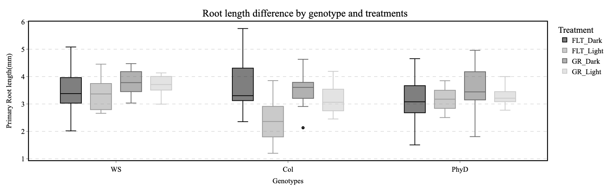

# CARA root modeling template

**Title:** "Modulation of Photomorphogenesis in Spaceflight Alters Root System Architecture in WT Col causing dwarfing effect that is not observed but not in Col-0-_phyD_ and WS Mutants: New Insights from Deep Learning using images from ABRS and CARA mission".

**Abstract:**&#x20;

Photomorphogenesis and auxin transport are important processes that regulate root growth in plants. We investigated the role of these processes in root growth in microgravity by growing Arabidopsis thaliana seedlings in spaceflight or ground control conditions under light or dark conditions. Root growth was measured at various time points. RNA sequencing was used to identify genes that were differentially expressed in the spaceflight and ground control conditions. Mathematical modeling was used to simulate the effects of auxin transport on root growth. Our results showed that root growth was significantly reduced in spaceflight compared to ground control conditions for WT Col-0, but this reduction in root growth was more pronounced in seedlings that were grown under light conditions. RNA sequencing identified a number of genes that were differentially expressed in the spaceflight vs ground control conditions in both light and dark grown samples. These genes included genes involved in auxin transport, sucrose/GA transport, photomorphogenesis, and cell signaling revealing that the addition of light enables more cellular and molecular adaptations to the effects of spaceflight. Mathematical modeling using PIN protein expression changes showed that the reduction in auxin accumulation in columella and lateral root caps of spaceflight samples explain the changes in root length and diameter. These results suggest that photomorphogenesis and auxin transport play important roles in root growth in microgravity. The reduction in auxin transport in spaceflight may be due to a number of factors, including changes in the cytoskeleton and cell wall structure. The results of this study have implications for the design of future plant-based life support systems for long-duration spaceflight.

**Keywords:** Arabidopsis, PIN transporters, auxin, spaceflight, root growth patterns, waving, skewing, circadian rhythm, Systems biology, mathematical modeling,

**Paper outline / summary**

Introduction

* Photomorphogenesis is a process by which plants adjust their growth and development in response to light.
* One of the key players in photomorphogenesis is the phytochrome family of photoreceptors.
* Phytochromes are able to sense the presence or absence of light and regulate a variety of downstream genes, including genes involved in auxin transport.
* Auxin is a plant hormone that is involved in a wide range of developmental processes, including root growth.
* The goal of this study was to investigate the role of photomorphogenesis and auxin transport in root growth in microgravity.

Methods

* Arabidopsis thaliana seedlings were grown in spaceflight or ground control conditions under light or dark conditions.
* Root growth was measured at various time points.
* RNA sequencing was used to identify genes that were differentially expressed in the spaceflight and ground control conditions.
* Mathematical modeling was used to simulate the effects of auxin transport on root growth.

**Results**

* Root growth was significantly reduced in spaceflight compared to ground control conditions.
* The reduction in root growth was more pronounced in seedlings that were grown under light conditions.
* RNA sequencing identified a number of genes that were differentially expressed in the spaceflight and ground control conditions.
* These genes included genes involved in auxin transport, photomorphogenesis, and cell signaling.
* Mathematical modeling showed that the reduction in root growth in spaceflight could be attributed to a decrease in auxin transport.

**Discussion**

* These results suggest that photomorphogenesis and auxin transport play important roles in root growth in microgravity.
* The reduction in auxin transport in spaceflight may be due to a number of factors, including changes in the cytoskeleton and cell wall structure.
* The results of this study have implications for the design of future plant-based life support systems for long-duration spaceflight.

**Conclusion**

* This study has demonstrated the importance of photomorphogenesis and auxin transport in root growth in microgravity.
* A combination of environmental and genetic systems can be used to taylor plant architecture in microgravity.
* The results of this study have implications for the design of future plant-based life support systems for long-duration spaceflight.

**Introduction to plant tropisms:** Plants have evolved to grow and develop in the presence of gravity. However, when plants are grown in microgravity, their growth and development can be altered. This is because gravity plays an important role in a number of plant processes that include auxin transport including gravitropism, thigmotropism, chemotropism, oxytropism and hydrotropism.

**Introducing Auxin transport and the importance of gravity for polarity:** Auxin is a plant hormone that is involved in a wide range of developmental processes, including root growth, stem elongation, and leaf development. Auxin is transported from the shoot to the roots in a polar fashion, meaning that it is transported in a unidirectional manner. This polar transport is important for the development of a plant's root system.

**Gravitropism is the ability of plants to grow in response to a gravity vector:** Gravitropism is mediated by a number of factors, including auxin transport. When a plant is placed in a gravitational field, auxin is redistributed in the plant providing polarity in ion movement. This redistribution of auxin causes the plant to grow in a direction that is perpendicular to the gravitational field.

**Hydrotropism is the ability of plants to grow in response to water gradient:** Hydrotropism is mediated by a number of factors, including auxin transport. When a plant is placed in a water gradient, auxin is redistributed in the plant. This redistribution of auxin causes the plant to grow in the direction of the water gradient.

**Magnitude of tropisms are affected by microgravity:** Studies of effects of microgravity on a number of plant processes have provided evidence broadly links changes to auxin signaling and transport as being the primary mechanism for plants to adapt to spaceflight and the stresses related to spaceflight potentially indicating that they may be using part of their gravitropic response machinery to response to the stressors of spaceflight such as localized regions of hypoxia.

**Introducing system biology** In recent years, the application of systems biology and mathematical modeling to plant biology has grown rapidly. _Arabidopsis thaliana_ has emerged as a model system for these investigations due to its small genome and well-understood genetics. Many tools have been developed that allow researchers to use mathematical models to generate new and test old hypotheses.

* Read a [summary of the model here](https://www.ebi.ac.uk/biomodels/content/model-of-the-month?year=2013\&month=01) and down the [SimuPlant](https://www.simuplant.org/) modelling software
* Other modelling [tools and spaceflight astrobotany data are available on this website](https://astrobiology.botany.wisc.edu/gilroy-lab-home/astrobiology-course)

**Figure X: (A)** Cellular model showing the subcellular location of Auxin transport and signaling components. **(B)** Root tip model illustrating auxin levels predicted by the reverse foundation model of auxin movement in the root and lateral apexes. Here’s a link to a [video of the model in action](https://www.youtube.com/watch?v=emd6tUy1pBo\&ab\_channel=RichardBarker).

**Summary this review of light and auxin?**

[**https://www.mdpi.com/1422-0067/24/6/5253**](https://www.mdpi.com/1422-0067/24/6/5253)

The Role of Light-Regulated Auxin Signaling in Root Development

**Summary of this review of auxin and gravitropism**

[**https://www.researchgate.net/publication/369654477\_Research\_advances\_in\_plant\_root\_geotropism**](https://www.researchgate.net/publication/369654477\_Research\_advances\_in\_plant\_root\_geotropism)

[**https://link.springer.com/article/10.1007/s10725-023-00992-4**](https://link.springer.com/article/10.1007/s10725-023-00992-4)

**Phytochrome mediates regulating hormone movement in response to light and microgravity:**

**Introducing Auxin reporters in microgravity**

Pea paper & confocal in space paper?

**Introducing CARA study & genotypes: ??**

Note: Original paper incorrectly labels the _phyD_ mutants as being in the WS ecotype background, however, it is actually in the Col background.

In this study, we investigate the role of the PIN auxin transporter during spaceflight and translate environmental signals, such as light or dark, into changes in growth patterns. Additionally, we use mathematical modeling to study the effects of this transporter on Arabidopsis growth patterns during the CARA mission.

MAYBE using the data on PhyB, PhyA in Ler background (vs Col0) may be interesting (SEEDLING GROWTH missions?).RH

Summary this?

[**https://bsapubs.onlinelibrary.wiley.com/doi/full/10.1002/ajb2.1728**](https://bsapubs.onlinelibrary.wiley.com/doi/full/10.1002/ajb2.1728)

**&/or thus**

[**https://www.frontiersin.org/articles/10.3389/fspas.2021.729154/full**](https://www.frontiersin.org/articles/10.3389/fspas.2021.729154/full)

**Methods:**

RNASeq data from CARA processed by NASA **GeneLab provide many interactive data visualization options** [https://visualization.genelab.nasa.gov/data/GLDS-120](https://visualization.genelab.nasa.gov/data/GLDS-120)

**Reanalysis of RNAseq:** The CARA (GLDS-120) experiments including RNAseq using the GeneLab data visualization system to observe gene expression provides new insights into hormonal changes caused by the addition of light that enable new and novel metabolic adaptations.

**Mathematical modeling of auxin transport**: to investigate the role of the PIN transporters in Arabidopsis auxin distribution patterns during spaceflight. The expression levels of the PIN proteins were used to provide conductivity values to the cell walls where they’ve been shown to be expressed (See Table X for PIN protein tissue specific pattern summary), using python jupyter notebook.

**Reanalysis of images from LSDA:** Images were downloaded from ALSDA, aligned in adobe bridge image raw, quantified with SmartRoot Fiji plugin, plotted with ArchiDart using Rstudio. MNDS and PCA dimensionality reduction was applied.

**Anoxia and hypoxia experiment:** Plants were grown on standard media as described by Choi et al., (XX), plates were then inserted into custom lids with valves attached that allow nitrogen gas to create an anoxic environment for 1, 2, or 3 hours. Plants were images during and after the anoxia treatment using a flatbed scanner recording images at 15min intervals. Nightingale plots were used to plot the direction of growth after hypoxia treatment.

**Results:**

**Note: for all results, we should probably remove the 2 samples from which we have no images**

1\. Image analysis

Fig X: A) infographic of labeling method B) root length, C) root diameter/thickness

2\. Omics results

Fig X: A) DeSeq analysis B) Clustering

\-Summary of differential expression changes

\-Clustering of omics data with ICA into functional clusters

3\. Auxin modeling

Fig X: Auxin modeling output

4\. Regression modeling of omic clusters and root architecture

Fig X: Model outputs, clusters predictive of root length, and diameter

**Describe Auxin Transport modeling:** Our modeling experiment revealed that the PIN transporters are important for adaptation and development of Arabidopsis in spaceflight conditions and show that auxin distribution patterns may help explain physiological phenotypes observed during light. We found that the distribution of auxin in wild-type Arabidopsis (WS) resembles that of the Col-0 _phyD_ mutant during the CARA mission, as described by Paul et al. (2015). Our mathematical modeling revealed that this similarity in auxin distribution patterns may be responsible for the observed changes in growth patterns.

Description of the root system reanalysis.

To summarize the testing,

Length:

* There are significant difference in average root length between different treatment group (All 12) with p value = 3.35e-07
  * **Col-FLT-Light** was the most significant treatment having different root length with most of the other treatments
* There are significant difference in average root length between different genotype (All 3) with p value = 0.0284
  * The most significant difference was between WS and Col
  * PhyD and Col, PhyDand WS did not have significant differences in root length
* There are significant difference in average root length between different gravity treatments (All 2) with p value = 0.000609
* There are significant difference in average root length between different light treatments (All 2) with p value = 0.000594
* Is there significant difference in average length between different gravity treatments (2 gravity) within the same genotype?
  * Yes, all 3 genotypes had significant difference in root length, when having different gravity treatment with pvalue < 0.05
* Is there significant difference in average length between different light treatments (2 light) within the same genotype?
  * No, only **Col** had significant difference in root length, when having different light treatment with pvalue with < 0.05

Diameter:

* There are significant difference in average root diameter between different treatment group (All 12) with p value = 4.08e-09
  * **WS-FLT-Light/Dark and PhyD-FLT-Light/Dark** were the most significant treatment having different root diameter with most of the other treatments
* There are significant difference in average root diameter between different genotype (All 3) with p value = 0.000131
  * The most significant difference was between WS and PhyD
  * There was no significant difference between WS and Col
* There are significant difference in average root diameter between different gravity treatments (All 2) with p value = 0.0133
* There was **no** significant difference in average root diameter between different light treatments (All 2) with p value = 0.146
* Is there significant difference in average diameter between different gravity treatments (2 gravity) within the same genotype?
  * No, only **WS** had significant difference in root diameter, when having different gravity treatment with pvalue = 0.0115
* Is there significant difference in average diameter between different light treatments (2 light) within the same genotype?
  * No, only **PhyD** had significant difference in root diameter, when having different light treatment with pvalue = 0.016

Surface:

* There are significant difference in average root surface between different treatment group (All 12) with p value = 3.47e-07
  * **Col-FLT-Light** was the most significant treatment having different root surface with most of the other treatments
* There are **no** significant difference in average root surface between different genotype (All 3) with p value = 0.131
  * There were no significant difference between any genotype
* There are significant difference in average root surface between different gravity treatments (All 2) with p value = 4.36e-05
* There are **no** significant difference in average root surface between different light treatments (All 2) with p value = 0.228
* Is there significant difference in average surface between different gravity treatments (2 gravity) within the same genotype?
  * No, only **Col and WS** had significant difference in root surface, when having different gravity treatment with pvalue < 0.05
* Is there significant difference in average surface between different light treatments (2 light) within the same genotype?
  * No, only **Col** had significant difference in root surface, when having different light treatment with pvalue with < 0.05

Volume:

* There are significant difference in average root volume between different treatment group (All 12) with p value = 1.75e-07
  * **PhyD-FLT-Light** was the most significant treatment having different root volume with most of the other treatments
* There are significant difference in average root volume between different genotype (All 3) with p value = 0.00559
  * The most significant difference was between WS and PhyD
  * There was no significant difference between WS and Col
* There are significant difference in average root volume between different gravity treatments (All 2) with p value = 0.00497
* There are **no** significant difference in average root volume between different light treatments (All 2) with p value = 0.902
* Is there significant difference in average volume between different gravity treatments (2 gravity) within the same genotype?
  * No, only **Col and WS** had significant difference in root volume, when having different gravity treatment with pvalue < 0.05
* Is there significant difference in average volume between different light treatments (2 light) within the same genotype?
  * No, only **Col** had significant difference in root volume, when having different light treatment with pvalue with < 0.05

**Figure X: Light model**

**Figure X: Dark model**

**Describe Reanalysis images**

**Figure X: Increased variation in root tip angle and angle density”**

**Figure X: Enter description root length data and description of root diameter data**

**Figure X: Enter description of PCA and MDS Methods**

**Describe Analysis of new hypoxia response images**

**Figure X: Recovery rates reduction in O2 “Dark hypoxia skew**

**Figure X: Natural variation in recovery ates**

**Discussion**

**Prediction from image reanalysis: That Col-0-phyD should more closely resemble WS.**

**To summarize thestastical testing of the root systems,**

* **There are significant difference in average root length between different treatment group (All 12) with p value = 3.35e-07**
  * **Col-FLT-Light was the most significant treatment having different root length with most of the other treatments**
* **There are significant difference in average root length between different genotype (All 3) with p value = 0.0284**
  * **The most significant difference was between WS and Col**
* **There are significant difference in average root length between different gravity treatments (All 2) with p value = 0.000609**
* **There are significant difference in average root length between different light treatments (All 2) with p value = 0.000594**
* **Is there significant difference in average length between different gravity treatments (2 gravity) within the same genotype?**
  * **Yes, all 3 genotypes had pvalue < 0.05**
* **Is there significant difference in average length between different light treatments (2 light) within the same genotype?**
  * **No, only Col had significant pvalue with < 0.05**

**Prediction from IAA transport modeling: That auxin transport in Col-0-phyD should more closely resemble WS in darkness and to a lesser extend in light.**

The original paper states that there isn’t a reduction in root length in any of the genotypes when all treatments are considered. Interestingly if the light and dark treatments are separated then the Col-0 root are shorter in flight when grown in light and the _phyD_ roots have increased diameter in flight when grown in dark. These are 2 previously unseen phenotypes that may provide some clues about the potential influence of photomorphogenesis on plant architecture in microgravity. RNAseq shows upregulation of photosynthetic machinery, to increase the thylakoid number, may increase the efficiency of the dark reaction to process by products of anaerobic respiration and may even enable the roots to perform photosynthesis.

**Introduce Paper showing** confocal microscopy to observe DR5:GFP as a auxin signaling reporter during flight.

[https://bidd.group/spacelid/study.php?sid=SLID-284](https://bidd.group/spacelid/study.php?sid=SLID-284)

The effect of spaceflight on the gravity-sensing auxin gradient of roots: GFP reporter gene microscopy on orbit…“examined the spaceflight green fluorescent protein (GFP)-reporter gene expression in roots of transgenic lines of Arabidopsis thaliana: pDR5r::GFP, pTAA1::TAA1-GFP, pSCR::SCR-GFP to monitor auxin and pARR5::GFP to monitor cytokinin. Plants on the ISS were imaged live with the Light Microscopy Module (LMM), and compared with control plants imaged on the ground. Preserved spaceflight and ground control plants were examined post flight with confocal microscopy. Plants on orbit, growing in the absence of any physical reference to the terrestrial gravity vector, displayed typically "vertical" distribution of auxin in the primary root. This confirms that the establishment of the auxin-gradient system, the primary guide for gravity signaling in the root, is gravity independent. The cytokinin distribution in the root tip differs between spaceflight and the ground controls, suggesting spaceflight-induced features of root growth may be cytokinin related. The distribution of auxin in the gravity-sensing portion of the root is not dependent on gravity. Spaceflight appears benign to auxin and its role in the development of the primary root tip, whereas spaceflight may influence cytokinin-associated processes.”

**Awesome Cytokinin paper 2021** -> [https://www.mdpi.com/1422-0067/22/8/3874](https://www.mdpi.com/1422-0067/22/8/3874)

**Introduce Skewing data in ABRS & VEGGIE discussion**

Sucrose is used in the media

**Sucrose transport and anoxia.**

Loreti et al. (2005) + -> RNAseq reanalysis reveals import role for SWEET transporters.

**BRIC19/BRIC20: hypoxia in darkness leads to high light ROS response in WS and Col**

Other BRICs? -> Focus on RNAseq new BRIC study

Without light there is extensive adaption in relation to amino acid metabolism and transport.

**Introducing Col-**_**phyD**_** Where in the root could a **_**phyD**_** mutation effect root growth? (scell RNAseq and fluorescent cell sorting discussion)**

* **Columella and**
* **Lateral root cap**
* **Epidermis in before transition zones**

**Effect of low oxygen on auxin transport**

* **How might this affect auxin biosynthesis and cytokinin gradients?**
* **How would this change tip angle growth?**
* **How could these locations influence cell size and shape?**

**Taken together these data show the Col-0 **_**phyD**_** mutant root system architecture more closely resembles WS.**

**Col-**_**phyD**_** and WS have similar auxin transport patterns and this is reflected in the similarity of their root system architecture.**

Follow up experiments (Figure X,X) show response to anoxia assays show low oxygen can effect root length and growth trajectory. There is ecotype variation in the plants response to low oxygen and it is interesting to note that WS exhibit large skews in response to changes in oxygen availability and this may potentially be the cause of the skewing root behavior observed during the ABRS mission (GLDS-7). In addition, these data also show that Ler has a left handed skew in response to low oxygen, a phenotypic response previously observed in the BRIC17 (Johnson et al., xx) and in the EMCS TROPI study (Vanderbrink et al., XX)

**Conclusion**:

The presence of light powers a circadian transport of Auxin in the root tip following the reverse fountain model (Swarup et al., 205), the photomorphogenesis enables a plethora of adaptive responses to spaceflight. The secondary biproducts of roots metabolism, microgravity induced root photosynthesis has the potential to change the root morphology making them growth either shorter or wider in diameter. The results of these studies have shown that microgravity can have a significant impact on plant growth and development. This is important information for scientists who are developing plant-based life support systems for long-duration spaceflight.

**Final model idea?…**. Does it need a protein-protein interaction model?-> could GPEC to pull some nodes from CARA?

How is the change in phytochrome dependent signaling during in plant experiencing spaceflight with light on their roots experiencing a reduction in growth, but if they have a Col-_phyD_ mutation then the root increases in diameter?

RNAseq shows -> something to do with sucrose transporters ;-)

[https://www.ncbi.nlm.nih.gov/pmc/articles/PMC4330589/](https://www.ncbi.nlm.nih.gov/pmc/articles/PMC4330589/)

Figure below adapted from [Maciek Adamowski](https://pubmed.ncbi.nlm.nih.gov/?term=Adamowski%20M%5BAuthor%5D) and[ Jiří Friml](https://pubmed.ncbi.nlm.nih.gov/?term=Friml%20J%5BAuthor%5D)1 (2015)

_I wonder how this would look +/- gravity & +/- light?_

Figures below….

**Table X**: Studies related PIN proteins and auxin in space. Source the SpaceLID DB.

| **Study Titles**                                                                                                                                                                               | **Studied Biophysical Phenomena**                                 | **Studied Biological Phenomena**                                                                                                                                                                                                                                                           | **SpaceLid ID & weblink**                                      |
| ---------------------------------------------------------------------------------------------------------------------------------------------------------------------------------------------- | ----------------------------------------------------------------- | ------------------------------------------------------------------------------------------------------------------------------------------------------------------------------------------------------------------------------------------------------------------------------------------ | -------------------------------------------------------------- |
| The effect of spaceflight on the gravity-sensing auxin gradient of roots: GFP reporter gene microscopy on orbit                                                                                | ●Study of fluorescent reporters for Auxin and cytokinin signaling | 
●Growth - Root ---> Microgravity response

●Reporter - Plant hormone ---> Auxin

●Reporter - Plant hormone ---> Cytokinin
                                                                                                                                                 | [SLID-284](https://bidd.group/spacelid/study.php?sid=SLID-284) |
| A spaceflight experiment for the study of gravimorphogenesis and hydrotropism in cucumber seedlings                                                                                            | ●Gravitational pull - Gravitropism                                | 
●Growth - Root ---> Hydrotropism

●Growth - Root ---> Gravitropism

●Component - Plant hormone ---> Auxin
                                                                                                                                                                 | [SLID-196](https://bidd.group/spacelid/study.php?sid=SLID-196) |
| Gravitropism interferes with hydrotropism via counteracting auxin dynamics in cucumber roots: clinorotation and spaceflight experiments                                                        | ●Gravitational pull - Gravitropism                                | 
●Growth - Root ---> Hydrotropism

●Growth - Root ---> Gravitropism

●Component - Plant hormone ---> Auxin

●Component - Plant hormone ---> Auxin transport protein
                                                                                                   | [SLID-197](https://bidd.group/spacelid/study.php?sid=SLID-197) |
| The gravity-induced re-localization of auxin efflux carrier CsPIN1 in cucumber seedlings: spaceflight experiments for immunohistochemical microscopy                                           | ●Study of PIN location in microgravity                            | 
●Component - Plant hormone ---> Auxin

●Reporter - Plant hormone ---> Auxin transport protein
                                                                                                                                                                                  | [SLID-198](https://bidd.group/spacelid/study.php?sid=SLID-198) |
| Gravity-regulated localization of PsPIN1 is important for polar auxin transport in etiolated pea seedlings: Relevance to the International Space Station experiment                            | ●Gravitational pull - Gravitropism                                | 
●Component - Plant hormone ---> Auxin

●Reporter - Plant hormone ---> Auxin transport protein
                                                                                                                                                                                  | [SLID-172](https://bidd.group/spacelid/study.php?sid=SLID-172) |
| STS-95 space experiment for plant growth and development, and auxin polar transport                                                                                                            | ●Gravitational pull - Gravitropism                                | 
●Growth - Seed germination ---> Epicotyls extensibility

●Growth - Seed germination ---> Coleoptiles extensibility

●Growth - Seed germination ---> Epicotyls direction

●Growth - Seed germination ---> Epicotyls angle

●Component - Plant hormone ---> Auxin
 | [SLID-168](https://bidd.group/spacelid/study.php?sid=SLID-168) |
| Polar auxin transport is essential to maintain growth and development of etiolated pea and maize seedlings grown under 1 g conditions: Relevance to the international space station experiment | ●Gravitational pull - Gravitropism                                | 
●Growth - Seed germination ---> Coleoptile length

●Growth - Seed germination ---> Mesocotyls length

●Component - Plant hormone ---> Auxin
                                                                                                                               | [SLID-169](https://bidd.group/spacelid/study.php?sid=SLID-169) |

**Table X:** Summary of PIN proteins, their subcellular location and the tissues where they’ve been shown to transport auxin. Image of immuno-fluorescent antibodies localisation can be found at NCBI Nottingham [https://www.ncbi.nlm.nih.gov/pmc/articles/PMC7738516/](https://www.ncbi.nlm.nih.gov/pmc/articles/PMC7738516/)

| **PIN protein** | **TAIR ID** | **Tissue**              | **Subcellular location**       | **Ref(s)**      |
| --------------- | ----------- | ----------------------- | ------------------------------ | --------------- |
| PIN1            | AT1G73590   | Stelle, Vasculature, QC | Plasma membrane                | Check & add ref |
| PIN2            | AT1G29760   | Epidermis, cortex,      | Plasma membrane                | Check & add ref |
| PIN3            | AT1G29770   | Columella               | Plasma membrane                | Check & add ref |
| PIN4            | AT1G73580   | QC, Initial cells       | Plasma membrane                | Check & add ref |
| PIN5            | AT1G58860   | x?x                     | Endoplasmic reticulum membrane | Check & add ref |
| PIN6            | AT1G29780   | x?x                     | Endoplasmic reticulum membrane | Check & add ref |
| PIN7            | AT1G29790   | Columella               | Plasma membrane                | Check & add ref |

**Description of graphs below…**

**Figure XX: Light**

**Modeling figures / presentation ->**

[**https://docs.google.com/presentation/d/1Vr3eXuzvMWYQfodv9W8xeHwd7U6poq6ZMDsSzttPsys/edit?usp=sharing**](https://docs.google.com/presentation/d/1Vr3eXuzvMWYQfodv9W8xeHwd7U6poq6ZMDsSzttPsys/edit?usp=sharing)

**Table XX:**

**Describe of the effect of dark on pin protein expression**

**Describe of the effect of Light / skotomorphogenesis on PIN protein expression in microgravity**

_**Describe the tissue specific distributions…**_

**Description of graphs below…**

**Supplimentary Figure XX: Dark**

**Table XX:**

**Describe of the effect of dark on pin protein expression**

**Describe of the effect of DARK / skotomorphogenesis on PIN protein expression in microgravity**

_**Discuss the potential morphological effect of these changes tissue specific distributions of auxin…**_

**Description of graphs below…**

**(A)**

**(B)**

**Figure xx:** Box plots showing Root length and diameter of 11 day old seedlings. Col, WS and Col-_phyD_ on Earth and on the ISS.

**Figure XX: Surface and volume…**

**Could simply this?**

**Description of graphs below…**

ASLDS image archive provided images that were aligned in adobebridge image raw, then traced using smartroot in imageJ/FIJI. Image tracings were quantified and saved in the root system markdown language (RSML) to exable plotting. Figures X show that on day 11 there was an observable difference between the orientation of the roots and associated root density changes shown by the PCA and MNDS plots show that the phyD mutants more closely resembles the WS ecotype when multiple phenotypes are incorporated into the model.

**Supplementary Figure XX:** Summary of image analysis pipeline applied to the CARA image reanalysis. Overall correlation analysis summarized as a MDS and PCA plot. Raw data plotted as a skeleton with the orientation determined by the orientation magnitude. Root orientation plotted as density nightingale plots.

**Note:** [**Link to high resolution version**](https://docs.google.com/presentation/d/1Vr3eXuzvMWYQfodv9W8xeHwd7U6poq6ZMDsSzttPsys/edit?usp=sharing) **if needed?**

**Description of graphs below…**

Summary of the Auxin signaling pathway Arabidopsi RNAseq.

Note that this Auxin summary can evolve based on the new data being processed through the GeneLab pipeline

List of GLDS- -37, -38, -213, -251, -121

Includes many tissues and organs. -> could list them all ?

Figures X:

**Supplementary Figures X:** Summary Log2 Fold Change expression for auxin signaling components

[Link to slide show for clear version, see slide #50](https://docs.google.com/presentation/d/1Vr3eXuzvMWYQfodv9W8xeHwd7U6poq6ZMDsSzttPsys/edit?usp=sharing).

CARA IAA Model

**Description of graphs below…**

**Supplementary Figure XX:** Box and whisker plots showing root skewing direction: Center lines show the medians; box limits indicate the 25th and 75th percentiles; whiskers extend to minimum and maximum values. Nightingale plots showing root skew directs with a bin size of 10 degrees. n = 45.

**Note:** [**Link to high resolution version**](https://docs.google.com/presentation/d/1Vr3eXuzvMWYQfodv9W8xeHwd7U6poq6ZMDsSzttPsys/edit?usp=sharing) **if needed?**

**Description of graphs below…**

Follow up investigation into ecotype variation in anoxia response.

Root elongation rates show recovery rate is relative to the length of the anoixa experience by the plant.

(A)

(B)

**Supplementary Figure XX: (A)** Comparison of 4 Arabidopsis ecotypes (Col-0, Ler-0, Cvi-0, WS-2) root elongation kinetics post 3 hours of anoxia treatment. (B) WS-2 expressed the greatest root elongation, following with Col-0, Cvi-0, and Ler-0. n = 7-16. Comparison of root elongation kinetics in Col-0 post 1 hour, 2 hours and 3 hours of anoxia treatment. n = 7-16.

**Note: Hi Resolution version if needed?**

**Description of graphs below…**

**(A)**

(B)

**Supplementary FigureXX :** () Comparison of root elongation kinetics in Col-0 post 1 hour, 2 hours and 3 hours of anoxia treatment. n = 7-16. Comparison of GeneLAB varieties (Col-0, Ler-0, Cvi-0, WS-2) root elongation kinetics post 3 hours of anoxia treatment. WS-2 expressed the greatest root elongation, following with Col-0, Cvi-0, and Ler-0. n = 7-16.

**Note:** [**Link to high resolution version**](https://docs.google.com/presentation/d/1Vr3eXuzvMWYQfodv9W8xeHwd7U6poq6ZMDsSzttPsys/edit?usp=sharing) **if needed?**

**References**

**Citation: Paul A-L, Sng NJ, Zupanska AK, Krishnamurthy A, Schultz ER, Ferl RJ (2017) Genetic dissection of the Arabidopsis spaceflight transcriptome: Are some responses dispensable for the physiological adaptation of plants to spaceflight? PLoS ONE 12(6): e0180186.** [**https://doi.org/10.1371/journal.pone.0180186**](https://doi.org/10.1371/journal.pone.0180186)

**Root and Hormone Modeling**

* **DIETRICH D, PANG L, KOBAYASHI A, FOZARD JA, BOUDOLF V, BHOSALE R, ANTONI R, NGUYEN T, HIRATSUKA S, FUJII N, MIYAZAWA Y, BAE TW, WELLS DM, OWEN MR, BAND LR, DYSON RJ, JENSEN OE, KING JR, TRACY SR, STURROCK CJ, MOONEY SJ, ROBERTS JA, BHALERAO RP, DINNENY JR, RODRIGUEZ PL, NAGATANI A, HOSOKAWA Y, BASKIN TI, PRIDMORE TP, DE VEYLDER L, TAKAHASHI H and BENNETT MJ, 2017.**[ **Root hydrotropism is controlled via a cortex-specific growth mechanism.**](http://rdcu.be/rSsk) **Nature plants. 3, 17057**
* **XUAN W, BAND LR, KUMPF RP, VAN DAMME D, PARIZOT B, DE ROP G, OPDENACKER D, MÖLLER BK, SKORZINSKI N, NJO MF, DE RYBEL B, AUDENAERT D, NOWACK MK, VANNESTE S and BEECKMAN T, 2016.**[ **Cyclic programmed cell death stimulates hormone signaling and root development in Arabidopsis.**](http://dx.doi.org/10.1126/science.aad2776) **Science (New York, N.Y.). 351(6271), 384-7**
* **BAND, LEAH R., WELLS, DARREN M., FOZARD, JOHN A., GHETIU, TEODOR, FRENCH, ANDREW P., POUND, MICHAEL P., WILSON, MICHAEL H., YU, LEI, LI, WENDA, HIJAZI, HUSSEIN I., OH, JAESUNG, PEARCE, SIMON P., PEREZ-AMADOR, MIGUEL A., YUN, JEONGA, KRAMER, ERIC, ALONSO, JOSE M., GODIN, CHRISTOPHE, VERNOUX, TEVA, HODGMAN, T. CHARLIE, PRIDMORE, TONY P., SWARUP, RANJAN, KING, JOHN R. and BENNETT, MALCOLM J., 2014.**[ **Systems Analysis of Auxin Transport in the Arabidopsis Root Apex**](http://dx.doi.org/10.1105/tpc.113.119495) **PLANT CELL. 26(3), 862-875**
* **DYSON, ROSEMARY J., VIZCAY-BARRENA, GEMA, BAND, LEAH R., FERNANDES, ANWESHA N., FRENCH, ANDREW P., FOZARD, JOHN A., HODGMAN, T. CHARLIE, KENOBI, KIM, PRIDMORE, TONY P., STOUT, MICHAEL, WELLS, DARREN M., WILSON, MICHAEL H., BENNETT, MALCOLM J. and JENSEN, OLIVER E., 2014.**[ **Mechanical modelling quantifies the functional importance of outer tissue layers during root elongation and bending**](http://dx.doi.org/10.1111/nph.12764) **NEW PHYTOLOGIST. 202(4), 1212-1222**
* **J LAVENUS, LR BAND, AM MIDDLETON, M WILSON, M LUCAS, L LAPLAZE and MJ BENNETT, 2013.**[ **Toward a Virtual Root: Interaction of Genomics and Modeling to Develop Predictive Biology Approaches**](http://onlinelibrary.wiley.com/book/10.1002/9781118447093)**. **_**In:**_** M CRESPI, ed., Root Genomics and Soil Interactions John Wiley & Sons, Inc.. 79-92**
* **PERET, BENJAMIN, MIDDLETON, ALISTAIR M., FRENCH, ANDREW P., LARRIEU, ANTOINE, BISHOPP, ANTHONY, NJO, MARIA, WELLS, DARREN M., PORCO, SILVANA, MELLOR, NATHAN, BAND, LEAH R., CASIMIRO, ILDA, KLEINE-VEHN, JUERGEN, VANNESTE, STEFFEN, SAIRANEN, ILKKA, MALLET, ROMAIN, SANDBERG, GORAN, LJUNG, KARIN, BEECKMAN, TOM, BENKOVA, EVA, FRIML, JIRI, KRAMER, ERIC, KING, JOHN R., DE SMET, IVE, PRIDMORE, TONY, OWEN, MARKUS and BENNETT, MALCOLM J., 2013.**[ **Sequential induction of auxin efflux and influx carriers regulates lateral root emergence**](http://dx.doi.org/10.1038/msb.2013.43) **MOLECULAR SYSTEMS BIOLOGY. 9,**
* **BAND, LEAH R. and BENNETT, MALCOLM J., 2013.**[ **Mapping the site of action of the Green Revolution hormone gibberellin**](http://dx.doi.org/10.1073/pnas.1301609110) **PROCEEDINGS OF THE NATIONAL ACADEMY OF SCIENCES OF THE UNITED STATES OF AMERICA. 110(12), 4443-4444**
* **BAND, L.R., UBEDA-TOMAS, S., DYSON, R.J., MIDDLETON, A.M., HODGMAN, T.C., OWEN, M.R., JENSEN, O.E., BENNETT, M.J and KING, J.R., 2012.**[ **Growth-induced hormone dilution can explain the dynamics of plant root cell elongation**](http://dx.doi.org/10.1073/pnas.1113632109) **Proceedings of the National Academy of Sciences of the United States of America: PNAS. 109(19), 7577-7582**
* **BAND. L.R., WELLS, D.M., LARRIEU, A., SUN, J., MIDDLETON, A.M., FRENCH, A.P., BRUNOUD, G., SATO, E.M., WILSON, M.H., PÉRET, B., OLIVA, M., SWARUP, R., SAIRANEN, I., PARRY, G., LJUNG, K., BEECKMAN, T., GARIBALDI, J.M., ESTELLE, M., OWEN, M.R., VISSENBERG, K., HODGMAN, T.C., PRIDMORE, T.P., KING, J.R., VERNOUX, T. and BENNETT, M.J., 2012.**[ **Root gravitropism is regulated by a transient lateral auxin gradient controlled by a tipping-point mechanism**](http://www.pnas.org/content/109/12/4668) **Proceedings of the National Academy of Sciences of the United States of America. 109(12), 4668-4673**
* **DYSON, R.J., BAND, L.R. and JENSEN, O.E., 2012.**[ **A model of crosslink kinetics in the expanding plant cell wall: yield stress and enzyme action**](http://www.sciencedirect.com/science/article/pii/S0022519312002251) **Journal of Theoretical Biology. 307, 125-136**
* **PERET B, LI G, ZHAO J, BAND L, VOSS U, POSTAIRE O, LUU D, DA INES O, CASIMIRO I, LUCAS M, WELLS D, LAZZERINI L, NACRY P, KING J, JENSEN O, SCHAFFNER A, MAUREL C and BENNETT MJ, 2012.**[ **Auxin regulates Aquaporin function to facilitate lateral root emergence.**](http://dx.doi.org/10.1038/ncb2573) **Nature Cell Biology. 10, 991-8**
* **BAND, L.R. and KING, J.R., 2012.**[ **Multiscale modelling of auxin transport in the plant-root elongation zone**](http://www.springerlink.com/content/x74n1467354q6075/) **Journal of Mathematical Biology. 65(4), 743-785**
* **NELSON, M.R., BAND, L.R., DYSON, R.J., LESSINNES, T., WELLS, D.M., YANG, C., EVERITT, N.M., JENSEN, O.E. and WILSON, Z.A., 2012.**[ **A biomechanical model of anther opening reveals the roles of dehydration and secondary thickening**](http://onlinelibrary.wiley.com/doi/10.1111/j.1469-8137.2012.04329.x/abstract) **New Phytologist. 196(4), 1030-1037**
* **LR BAND, JA FOZARD, C GODIN, OE JENSEN, T PRIDMORE, MJ BENNETT and JR KING, 2012.**[ **Multiscale Systems Analysis of Root Growth and Development: Modeling Beyond the Network and Cellular Scales**](http://www.plantcell.org/content/early/2012/10/29/tpc.112.101550) **The Plant Cell.**
* **TWYCROSS, J., BAND, L.R., BENNETT, M.J., KING, J.R. and KRASNOGOR, N., 2010.**[ **Stochastic and deterministic multiscale models for systems biology: an auxin-transport case study**](http://www.biomedcentral.com/1752-0509/4/34) **BMC Systems Biology. 4, 34**

**Fold change source**

[https://osdr.nasa.gov/bio/repo/data/studies/OSD-37](https://osdr.nasa.gov/bio/repo/data/studies/OSD-37) -> 4 ecotypes for the natural variation to hypoxia in flight (dark BRIC)

Fold change = FL vs GC

[https://osdr.nasa.gov/bio/repo/data/studies/OSD-120](https://osdr.nasa.gov/bio/repo/data/studies/OSD-120) -> 3 genotypes for light vs DARK…

Fold change = FL vs GC

Metabolic flux viz’ / Pathway viewer options

[https://pathways.embl.de/](https://pathways.embl.de/)

[https://www.genome.jp/kegg/mapper/](https://www.genome.jp/kegg/mapper/)

Metabolite data -> Millar review supplementary data (light and dark)

[https://elicit.org/](https://elicit.org/)

search?q=How+does+oxygen+affect+auxin+transport+in+Arabidopsis+roots%3F\&token=01GZ9EFZRMNX5ZPX4T37H3RRAB

Elicit AI test…

The papers suggest that oxygen affects auxin transport in Arabidopsis roots by regulating the expression and activity of auxin transporters. Gälweiler 1998 found that the PIN1 gene encodes a protein that acts as a transmembrane component of the auxin efflux carrier in vascular tissue. Casimiro 2001 showed that the auxin transport inhibitor NPA blocks basipetal IAA movement from the root tip, which is critical for lateral root initiation. Marchant 1999 demonstrated that the AUX1 protein facilitates auxin uptake within root apical tissues, and regulates root gravitropism by co-ordinating the localized redistribution of auxin within the Arabidopsis root apex. Finally, Ljung 2005 identified an important auxin source in the meristematic region of the primary root tip as well as in the tips of emerged lateral roots, and showed that root-localized IAA synthesis is diminished in a cyp79B2 cyp79B3 double knockout. Overall, these findings suggest that oxygen affects auxin transport in Arabidopsis roots by regulating the expression and activity of auxin transporters, which in turn affects various aspects of root development.
